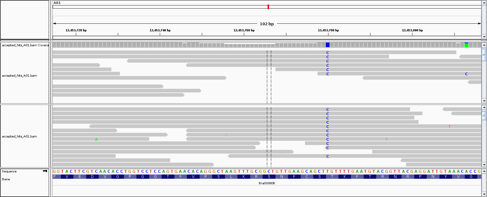
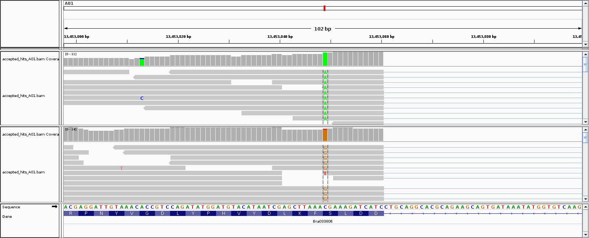
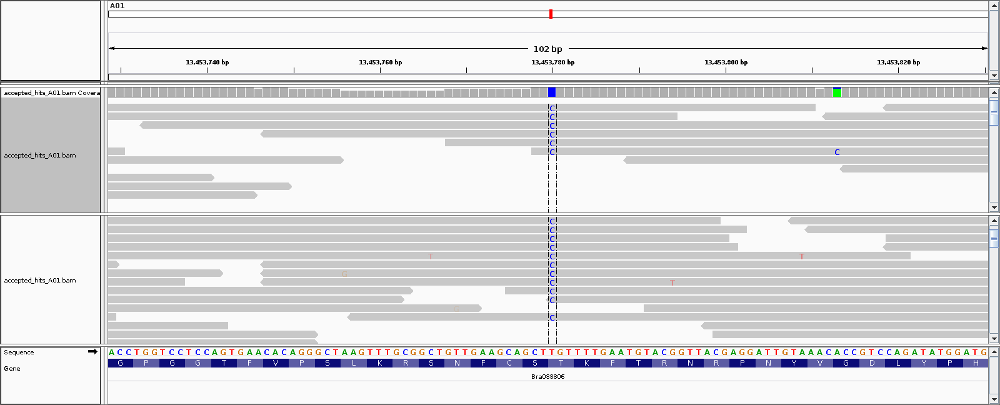

_Score:_ 86.0/88
# BIS180L Final Exam

__Spring, 2017__  
__Available June 6, 2017__  
__Due June 12, 9:00 AM__  

__88 points total__

__Student Name:__ Koki Sasagawa
 
__Student ID:__ 999054646

# Limitations
This exam is open book, open notes, open web
__HOWEVER__
You CANNOT discuss the questions with any person or entity.  
You CANNOT request help from any person, online forum, listserv, chatroom, or other entity, etc.

You CAN ask Gina or Professor Maloof for help or clarification.

# Instructions

1. Work by adding your answers to this .Rmd file
2. For all questions provide any code that you used to answer them, formatted as a code block.  __To format non-R code as a code block you can surround it by three back ticks, just like R code.  Just omit the {r } and R will not try to run it when you knit the document__
3. For the R questions, the code should run and embed the answers when you knit this file.
4. If the code does not run still included it, you may get partial credit.  If it given an error and prevents knitting, then include "eval=FALSE" at the beginning of the code chunk, i.e.
```{r, eval=FALSE}
#R won't run this so the file will knit even though there is an error
plot(1:10,2:21)
```
5. __Look at your knitted html before turning it in.  Ensure the formatting is OK__
6. __Be sure that your knitted file does not contain long tables, etc.__
7. When you are ready to turn in the exam, knit an html file, add both the .Rmd an the .html file and push to your repository.

## Question 0 (4 points)

Throughout this assignment, you code should have helpful comments and appropriate variable names.

1 pt for helpful comments  
1 pt for appropriate variable names  
2 pts for well formatted Rmarkdown and resulting html  

## Question 1 (10 points)
Start IGV.  Load __both__ the IMB211 and R500 tophat "Accepted Hits" bam files from Assignment 5 into the same IGV session.  If you no longer have the files see [the IGV lab](http://jnmaloof.github.io/BIS180L_web/2017/05/16/Illumina-Day-2/) to download again.

(For the screenshots requested below position the base of interest between the two black lines in the middle of the viewer).

Remember that as long as you put your image files in your git directory that you can include screenshots in your knitted Rmd with code like this (but change `eval=FALSE` to `eval=TRUE`):

```{r, eval=FALSE} 
knitr::include_graphics("Final2017Shiny2.png")
```

__a. (2 points)__ Find a read where an apparent polymorphism is likely due to sequencing error.  
**PS** -0
* Take a screenshot and include it in your knitted file.
* Why do you think this is due to a sequencing error?  Note: you can determine the quality of the base by hovering the pointer over it; look for the line similar to "BASE = A @ QV 30".
```{r, eval=TRUE}

```

> The polymorphism shown here (A01:13,453,766) is likely due to sequencing error as it is only found in one of the reads. Each base has a quality score called PHRED that represents how confident the machine is that a particular base is correct. The PHRED score ranges from 0 ~ 41, in order from least confident to most confident. The thymine here has a QV of 7 which indicates low machine confidence, thus suggesting that this polymorphisms is result of error in sequencing. 

> The polymorphisms that are only found on 1 read but have high QV can result from PCR error. The sequencer reads the sequence but has no way to tell what that particular nucleotide is supposed to be. 

__b. (3 points)__ Find a base that likely represents a SNP between R500 and IMB211.
**PS** -0
* Take a screenshot and include it in your knitted file.  
* What is the evidence that this is a true SNP?
* Are both R500 and IMB211 different from the reference sequence at this location or is one of the same (and if so, which one?)
```{r, eval=TRUE}

```

> This polymorphism here (A01:13,453,849) is likely a SNP as it appears across all reads and has relatively high QV values. In the reference sequence this nucleotide position is a Cytosine while in R500 it is an Adenine nucleotide, and in IMB211 it is a Guanine. The single thymine polymorphism seen in the reads of IMB211 has a high QV value of 37. This can result from a PCR error, which would explain why the sequencer can have high confidence as it reads the sequence, but is unable to tell what the particular nucleotide should have been.  

__c. (1 point)__ Find a base that likely represents a SNP where R500 and IMB211 match one another but differ from the reference
**PS** -0
* Take a screenshot and include it in your knitted file.
```{r, eval=TRUE}

```

__d. (4 points)__ For part __b.__ above:
**PS** -0
* Download the [IMB vs R500 vcf file](http://jnmaloof.github.io/BIS180L_web/data/IMB211_R500.vcf).  (This should be the same as your VCF file from Assignment 5 but safer to start with mine)
* Use R to extract the VCF information for the SNP that you reported in part __b.__ above (include your code and its output).
* Did Freebayes call this position as a polymorphism between IMB211 and R500?  
* Make a markdown table that shows the number of reads matching the reference or having an alternate allele for R500 and IMB211 at this position.  (You do not have to use code to make the table)

Upload the downloaded file and create data frame vcf.data:
```{r}
#Upload libraries
library(ggplot2)

#Read in the .vcf file calculated by FreeBayes
vcf.data <- read.table("./IMB211_R500.vcf", as.is = T, na.strings = ".")

#Check vcf.data was successfully uploaded
head(vcf.data)

#Add column heading to dataframe. Use system() which allows the command to be issued to the Linux shell. Headings start with '#' so use grep command to search for those lines. 'intern = TRUE' tells R to capture the output of the command. 
vcf.header <- system("grep '#C' IMB211_R500.vcf", intern = TRUE)

#Check that the headings are stored into vcf.header successfully 
vcf.header

#Remove the '#' symbol by using the sub() command.
vcf.header <- sub("#","", vcf.header)

#It is tab delimited so split on tabs to create substrings and make a vector to use as column names. 
vcf.header <- unlist(strsplit(vcf.header,split="\t"))
colnames(vcf.data) <- vcf.header

#Check that header names were successfully added
head(vcf.data)
```

Before looking for the VCF information for the SNP I found earlier format the dataframe to be more informative.
```{R}
#Break up the data in the last two columns to be more easily visble. Use strsplit() to split character string based at every occurance of a character. 

#Add NA to blank cells
vcf.data$IMB211[is.na(vcf.data$IMB211)] <- "NA:NA:NA:NA:NA:NA:NA"

#Create a temporary matrix
IMB211.tmp <- matrix(
  unlist(strsplit(vcf.data$IMB211,split = ":")),
  nrow=nrow(vcf.data),
  byrow=TRUE
  )
#Check that temporary matrix contains the information in the last column in separate columns. 
head(IMB211.tmp)

#Rename the column names
colnames(IMB211.tmp) <- paste("IMB211",c("gt","tot.depth","ref.depth","ref.qual","alt.depth","alt.qual","gen.lik"),sep="_")

#Repeat for R500
vcf.data$R500[is.na(vcf.data$R500)] <- "NA:NA:NA:NA:NA:NA:NA"

R500.tmp <- matrix(
  unlist(strsplit(vcf.data$R500,split = ":")),
  nrow=nrow(vcf.data),
  byrow=TRUE
  )
head(R500.tmp)
colnames(R500.tmp) <- paste("R500",c("gt","tot.depth","ref.depth","ref.qual","alt.depth","alt.qual","gen.lik"),sep="_")

#To our dataframe, bind the matrix we made as new columns. 
vcf.data <- cbind(vcf.data,IMB211.tmp,R500.tmp,stringsAsFactors=FALSE)

#Check that the binding was successful
summary(vcf.data)
head(vcf.data)

#Convert the columns that should be numbers back to numeric. Extract relevant columns, use apply to apply the as.numeric function to each column, and then place the results back in the correct place
vcf.data[,c("IMB211_tot.depth","IMB211_ref.depth","IMB211_ref.qual","IMB211_alt.depth","IMB211_alt.qual",
            "R500_tot.depth","R500_ref.depth","R500_ref.qual","R500_alt.depth","R500_alt.qual")] <- 
  apply(vcf.data[,c("IMB211_tot.depth","IMB211_ref.depth","IMB211_ref.qual","IMB211_alt.depth","IMB211_alt.qual",
            "R500_tot.depth","R500_ref.depth","R500_ref.qual","R500_alt.depth","R500_alt.qual")],
        2,
        as.numeric
        )

#In the dataframe vcf.data, from the column "POS" pull out the row with nucleotide position 13453489
vcf.data[vcf.data[,"POS"] == 13453849,]
```

> From the output Freebayes successfully called this position as a polymorphism between IMB211 and R500. 

|Cultivar|Match Poly|Match Ref|
|:------:|:--------:|:-------:|
|R500    |10        |0        |
|IMB211  |11        |0        |

## Question 2 (6 points).
The folder `FinalShiny1` contains a Shiny app that gives an error.
**PS** -0
* Correct the mistake so that the app works correctly.  (Only a single line needs to be fixed).
* Commit the change to git.
* Paste in the corrected line of code below: (the `eval=FALSE` in the code block below keeps R from running it when the file is knit)

```{r, eval=FALSE}
#paste in your corrected code here
#Previously it was missing the 'input$' before the 'gene' which is necessary to communicate with the users input that specifies which row(gene) to plot. 
barplot(counts[input$gene,],las=3)
```

## Question 3 (15 points). 
Even when the app is working the plot made by `FinalShiny1` is kind of ugly.  The folder `FinalShiny2` contains the same app as `FinalShiny1`.

* Update the plotting function in `FinalShiny2` so that it facets by genotype and treatment, and colors by treatment as is shown [here]().  Note the axes labels as well.
* Commit your changes to git.
* Display a screenshot of your app for gene `Bra031658` below.

_Hint: check out the "regmatches" code from the [May 18 lab](http://jnmaloof.github.io/BIS180L_web/2017/05/18/RNAseq-edgeR/); you will probably need to use something like that_

```{r, eval=TRUE}
knitr::include_graphics("Bra031658.png")
```

**JNM** -0 Nice Job!  A pleasure having you in the class.  Stay in touch.  Julin.

## Question 4. (8 points; no code required)
The file `final.sam` has a sam entry from a single read.  Answer the following questions:

__a.__ Interpret the CIGAR string: describe how this read aligns with the genome
**PS** -0
> 65 nucleotides aligned to the reference sequence, the next 97 nucleotides were skipped in the reference, then the last 33 nucleotides aligned with the reference sequence. 

__b.__ Can you determine from the information in the sam file if this matches the reference directly or if it is a reverse complement?
**PS** -0
> Looking a the sam file, the indicated FLAG bit value is 16 which corresponds to the sequence being reverse complemented.  

__c.__ What is the mapping quality of this read?  Interpret the mapping quality score: how confident are you that the read is mapped to the correct location?
**PS** -0
> The mapping quality (MAPQ) score is 50. The value is calculated as -10logPr{mapping position is wrong} rounded to the nearest integer. Thus a value of 50 means the probability the mapping is wrong is 0.00001. In other words, given 100,000 base calls one of them would be wrong. Based on the quality score alone I would say the read is mapped to the correct location with pretty good confidence.

__d.__ Is this file phred+33 or phred+64?
**PS** -0
> The file is most likely phred+33

## Question 5. (7 points; show code)

__a. (3 points)__ Display up to 10 rows of the vcf file (see problem 1) that have the genotype "2/2" (show your code).  
**PS** -0
```{r}
#Use the which function to pull the rows in which IMB211_gt or R500_gt is 2/2
rowsgeno22 <- which(vcf.data$IMB211_gt == "2/2" | vcf.data$R500_gt == "2/2")

#Create an empty datafame
vcf.data.geno22 <- data.frame()

#This for loop will add to the dataframe the rows that was returned earlier by using the which function
for (n in 1:length(rowsgeno22)) {
  vcf.data.geno22 <- rbind(vcf.data.geno22, vcf.data[rowsgeno22[n],])
}

#Display the first 10 rows
head(vcf.data.geno22, n = 10)

```
__b. (4 points)__ What does the genotype "2/2" indicate?  Why is it not listed as "1/1"?
**PS** -0
> The allele values are 0 for the reference allele, 1 for the first alternate allele and 2 for the second alternate allele and so on. The 2/2 refers to homozygous for a second alternate allele. It is not listed as 1/1 because the most prevalent genotype for that particular allele happens to be the second alternate allele. For example, looking at row 8082 in the vcf.data.geno22 dataframe, this position on chromosome A01 has a reference allele AAAA, and 2 additional alternate alleles GAAA and GAAC. IMB211 was (2/2) and homozygous for the second alternate allele GAAC while R500 was (1/1) and homozygous for the first alternate allele GAAA.  

## Question 6.  (6 points; no code required)
In the Genetic Networks lab we connected genes that had either negative or positive correlation values.

__a.__ Is it reasonable to connect genes with negative correlation values?
**PS** -0
> It is reasonable to connect genes with negative correlation values as it describes an inverse relationship. The increased expression of one gene can down regulate the expression of another gene. The expressed gene can function to lower the transcriptional activity of another gene, which is commonly found in nature.

__b.__ What type of relationship between two genes might lead to a negative correlation in expression values?
**PS** -0
> A negative feedback loop. An example is the TRP operon found in E.coli, where a group of genes encode enzymes required for the production of tryptophan. The TRP operon is actively expressed when tryptophan levels in the cell are low. The operon is regulated by the TRP repressor-active when bound to tryptophan-which binds to the operon and blocks translation. Thus, an increased expression in TRP will lead to a decreased expression of TRP enzymes.

## Question 7.  (15 points; show code)
Return to the gene networks generated in the Networks Two lab using a correlation threshold of 0.85.  The correlation matrix and adjacency matrix are included in the `Q7.Rdata` file in your repository.  You can load this with:

```{r}
load("./Q7.Rdata")
```

__a.__ What is the average connectivity in the network?
**PS** -0
```{r}
#Sum all of the 1's in each row (1 = connection)
sum.connection <- apply(genes_adj85, 1, sum)

#Sum the number of connections together and divide by the number of rows to get the average
ave.connect <- sum(sum.connection) / nrow(genes_adj85)

#Result
ave.connect
```

> The average connectivity in the network is 4.12

__b.__ Find the most highly connected gene.  
**PS** -0
```{r}
#Set the initial max.val to be 0
max.val = 0

#This for loop will iterate through the list sum.connection
for (n in 1:length(sum.connection)) {
  #Each time the value is greater than max.val, update max.val to be that new value
  if (sum.connection[n] > max.val) {
    max.val = sum.connection[n]
  }
}

#Results
max.val
```

> The most highly connected gene is Bra006273 with 28 connections. 

__c.__ Find the least connected gene that is still connected to the gene found in __b__.

```{r}
#Get the name of the genes using colnames
gene.names <- colnames(genes_adj85)

#Get the row for gene Bra006273 
gene.row <- which(rownames(genes_adj85) == "Bra006273")

#Initialize the minimum connection to 100 (obviously large number)
min.connection <- 100

#Initialize the temporary sum to 0
tmp.sum <- 0

#Get the column number of the gene with lowest connection
lowest.col <- 0 

#This for loop will iterate through the columns of the particular row for gene Bra006273
for (n in 1:ncol(genes_adj85)) {
  #Take the genes that have a connection with Bra006273
  if (genes_adj85[gene.row, n] == 1) {
    #If the gene has a connection with Bra006273, sum together all of the connection that particular gene has
    tmp.sum <- sum(genes_adj85[,n])
    #If the sum of all connections a particular gene has is less than the current value stored in min.connection, update min.connection with that new value
    if (tmp.sum < min.connection) {
      min.connection <- tmp.sum
      #Get the name of the gene with the lowest connection 
      lowest.gene <- gene.names[n]
      #Get the column of the gene with the lowest connection
      lowest.col <- n
    }
  }
}

#This is the gene that has a connection with Bra006273 and has the lowest total connections 
lowest.gene

#This is how many connections that gene has
min.connection
```
**PS** -0
> Out of all the genes that connect with Bra006273, Bra003687 has the lowest number of connections of 4. 

__d.__ Plot path between these two genes.
**PS** -1 figure error
```{r}
#Upload the package igraph 
library(igraph)

gene_graph85 <- graph.adjacency(genes_adj85, mode = "undirected")
#Create a matrix containing the shortest paths for each node
distMatrix <- shortest.paths(gene_graph85, v = V(gene_graph85), to = V(gene_graph85))
#Check 
head(distMatrix)[,1:7]

#Pull paths between node Bra006273 and Bra003687
pl <- get.shortest.paths(gene_graph85, gene.row, lowest.col)$vpath[[1]]

V(gene_graph85)[pl]$color <- paste("green")          # define node color
E(gene_graph85)$color <- paste("grey")               # define default edge color
E(gene_graph85, path = pl)$color <- paste("yellow")  # define edge color
E(gene_graph85, path = pl)$width <- 10               # define edge width
plot(gene_graph85, layout = layout.fruchterman.reingold, vertex.size = 6, vertex.label = NA)
```

__e.__ Compare the length of the path between these two genes to the average path length in the network.
**PS** -0
```{r}
#gene.row is the row for Bra006237 and lowest.col is the column for Bra003687 
distMatrix[gene.row, lowest.col]

#Calculate the average path length
average.path.length(gene_graph85)
```

> The path length between gene Bra006237 and Bra003687 is 1, smaller than the average path length of 3.66. That means the two genes are the most correlated to eachother with respect to expression levels than any other two genes are on average. 

## Question 8. (13 points; show code)
Let's explore the beta diversity from our rice rhizosphere experiment a little more. Use the distance matrix generated in QIIME to complete following.  Include the code and relevant output in your knitted file.

__a. (1 point)__ Import the included weighted distance matrix to R.  The file is called `weighted_unifrac_dm.txt` and is included in your repository.
**PS** -0
```{r}
#Use read.delim import matrix. Tab delimited. 
beta.diversity <- read.delim("./weighted_unifrac_dm.txt", header = TRUE, row.names = 1)

#Check if it was properly uploaded
head(beta.diversity)
summary(beta.diversity)
```

__b. (3 points)__ Plot the distance matrix in a cluster dendogram and use `rect.hclust` to draw boxes around the predominantly clustered groups. 
**PS** -1 dist
```{r}
#Plot data as Dendrogram
#dist function computes and returns distance matrix using the euclidean method 
hc <-(hclust(dist(beta.diversity)))
#Plot the Dendogram
plot(hc)
rect.hclust(hc, k = 4, border = "red")
```

__c. (3 points)__ Why did you select the k-value that you did? What is the consistent characteristic in the clusters you chose? Are there any clusters with mixed treatment or mixed genotype and why do you think that is?
**PS** -0
```{r}
#Load library cluster
library(cluster)

set.seed(125)

#Estimate what the best number of clusters is based off data
gap <- clusGap(beta.diversity, FUN = kmeans, iter.max = 30, K.max = 10, B = 50, verbose=interactive())
plot(gap, main = "Gap Statistic")
```

> I ran the clusGAP program to calculate the best k value to use for the clustering. I decided that 4 was the best k value to use as the graph levels off past that point. Looking at the clusters, I can see that they are being clustered primarily by treatment. The first cluster on the right is clustering by treatment M(1mm soil), the second one is cultivar Nipponbare Early, the 3rd cluster is by treatment E(root inside), and the last cluster is by treatment B(root surface). Having too high of a k value can make the clustering groups too small and is not well suited for constructing informative grouping for characterizing relationships among results. Having too few of a k value results in too broad of cluster groups and is unable to effectively group the data together. Nipponebare Early cultivar genotype probably had influence on the microbial community diversity enough to be clustered together. 

__d. (3 points)__ Plot the beta diversity as a heatmap. 
**PS** -0
```{r}
#load gplots
library(gplots)

#Change the dataframe into a matrix
beta.diversity.matrix <- as.matrix(beta.diversity)

heatmap.2(beta.diversity.matrix, Rowv=as.dendrogram(hc), scale="row", density.info="none", trace="none")
```

__e. (3 points)__ Which cluster has tiles indicating the samples are the most closely related? Which cluster has samples that are the least closely related to one another? How do you know?
**PS** -0
> The orange color corresponds to the average correlation of phylogenetic diversity of microbes which is set to 0. The darker the color becomes towards RED, the higher the correlation with respect to the average. Conversely, the brighter the color becomes towards YELLOW, this indicates lower correlation with respect to the average. The yellow cluster tile in the upper-left between IB2 and NEM2 and has a very low correlation between treatment M and treatment B. Looking at the beta.diversity.matrix, IB2 and NEM2 have a value of 0.376. The dark orange cluster near the upper right corner shows very high correlation for treatment B. Looking at the beta.diversity.matrix, IB2 and MB2 have a small value of 0.148. Lower value means higher correlation of phylogenetic diversity. 
